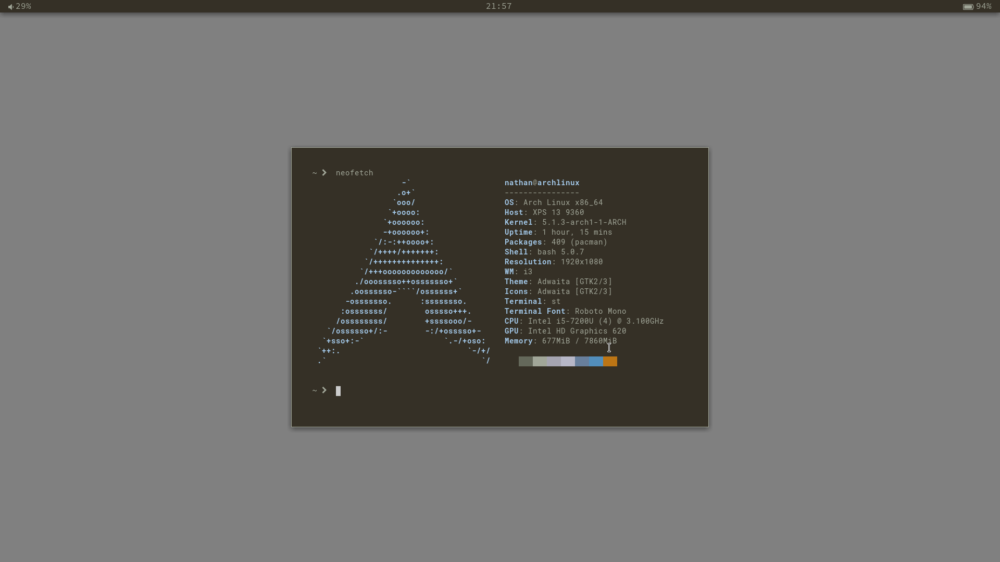

# About
These are my dotfiles for my minimalist i3-gaps rice for Arch linux. Made by Nathan Bockisch with a lot of help from dotfile examples.

# Installation
This is designed to work with Arch, Parabola, and other Arch-based distros. Designed for a fresh install with sudo and an internet connection.

To install, simply clone the repo and run "sudo ./install" from within the cloned directory.

